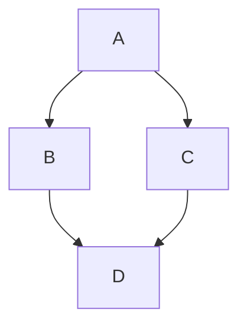

# Interactive Productivity Dashboard
This project is a web-based dashboard built for WEB -115 to demonstrate interctive JavaScript features.

## Future Enhancements
<<<<<<< HEAD
- [X] Add a weekly task goal calculator.
- [ ] Add JavaScript logic for a live clock.
- [ ] Integrate a task list with Array storage.

## Weekly Task Goals
This feature calculates a user’s task targets based on daily goals and weekly bonuses.
=======
- [ ] Add a metric converter.
- [ ] Integrate a task list with Array storage.
- [ ] Add JavaScript logic for a live clock.

Here is a simple flow chart:

>>>>>>> c8360391db09a45e63af947d24512c2389d6baf6
